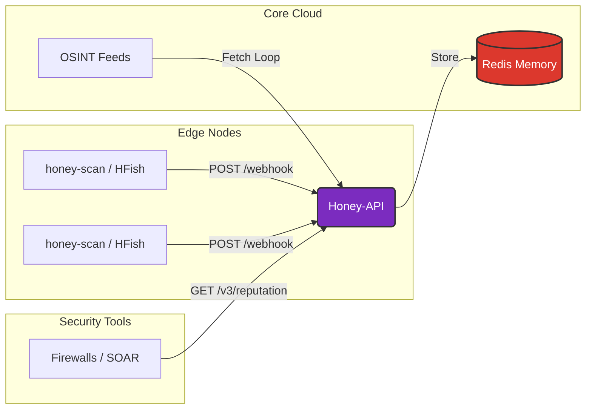

<div align="center">
  
  <h1>Honey Cloud Intelligence</h1>
  <p><strong>The Operational Brain of the Honey-Ecosystem</strong></p>

  [](https://github.com/lemueIO/honey-api/releases/tag/v2.4.1)
  [](https://www.python.org/)
  [](https://www.docker.com/)
  [](https://github.com/lemueIO/honey-api)

  <br>

  [](https://github.com/lemueIO/honey-api/stargazers)
  [](https://github.com/lemueIO/honey-api/network/members)
  [](https://github.com/lemueIO/honey-api/watchers)
  [](https://github.com/lemueIO/honey-api/graphs/contributors)

  <br>

  [](https://github.com/lemueIO/honey-api)
  [](LICENSE)
  [](https://github.com/lemueIO/honey-api/commits/main)
  [](https://github.com/lemueIO/honey-api/issues)

  <br>
  <br>

  **[ 🇬🇧 English ](README.md)** • **[ 🇩🇪 Deutsch ](README_DE.md)** • **[ 🇩🇪 Einfache Sprache ](README_DE2.md)** • **[ 🇺🇦 Українська ](README_UA.md)**
</div>

---

> [!NOTE]
> *Honey Cloud Intelligence (honey-api) is the centralized backend of the **Honey-Ecosystem**. It aggregates real-time attack data from distributed sensors (`honey-scan`), fuses it with global OSINT feeds, and exposes a high-performance Threat Intelligence API.*

<div align="center">
  <br>
  <a href="https://api.sec.lemue.org/status">
    
  </a>
  <br>
  <br>
  <em>Honey Cloud Intelligence Status Dashboard - <a href="https://api.sec.lemue.org/status"><strong>Live View</strong></a></em>
  <br>
</div>

---

## 🏗️ System Architecture

The **Honey-Ecosystem** consists of two primary components:
1.  **`honey-scan` (The Sensor)**: Runs on edge nodes (honeypots), detects attacks, and pushes raw logs to the API.
2.  **`honey-api` (The Brain)**: This repository. It receives data, manages whitelists/blacklists, and serves reputation queries.



## 🚀 Features

| Feature category | Description |
| :--- | :--- |
| **Central Aggregation** | Acts as the **hub** for all `honey-scan` nodes, creating a unified intelligence database. |
| **High Performance** | Powered by **FastAPI** and **Redis** for sub-millisecond response times. |
| **API Emulation** | Fully compatible with the **ThreatBook v3 API** standard for easy integration. |
| **Intelligent Filtering** | Supports **exact IP matches** and **CIDR ranges**. Automatically purges old entries. |
| **Advanced Logging** | Structural logging with color-coded ANSI tags (`[SYSTEM]`, `[CLEAN:DB]`) for ops visibility. |
| **Robust Monitoring** | Resilient **socket-level checks** and `/health` endpoints for orchestration. |

## 📡 API & Data Contracts

### 1. Ingestion Interface (Sensor -> API)
The bridge accepts data from `honey-scan` or HFish nodes via a webhook.

*   **Endpoint**: `POST /webhook`
*   **Auth**: IP-based whitelist (optional configuration via upstream proxy recommended)
*   **ContentType**: `application/json`

**Expected Payload:**
```json
{
  "attack_ip": "1.2.3.4"
}
```

### 2. Reputation Interface (Tools -> API)
Security tools query this endpoint to check if an IP is malicious. It formats data to match the ThreatBook v3 standard.

*   **Endpoint**: `GET /v3/scene/ip_reputation`
*   **Auth**: Required (`apikey` query parameter)

**Request:**
`GET /v3/scene/ip_reputation?apikey=YOUR_KEY&resource=192.168.1.5`

**Response:**
```json
{
    "code": 0,
    "data": {
        "192.168.1.5": {
            "severity": "high",
            "judgments": ["hfish honeypot"],
            "update_time": "2026-01-13 09:00:00"
        }
    },
    "message": "success"
}
```

## 🔗 Integration Setup

To connect a **`honey-scan`** node (or any HFish instance) to this API:

1.  **Deploy Honey-API**: Ensure this container is running and accessible (e.g., `http://10.0.0.5:8080`).
2.  **Configure Sensor**: In your `honey-scan` or HFish configuration, set the **Webhook URL**:
    ```bash
    # Example HFish / honey-scan configuration
    WEBHOOK_URL="http://10.0.0.5:8080/api/v1/webhook"
    ```
    *(Note: Ensure network connectivity between the sensor and the API container/host).*

## 📦 Installation

<details>
<summary><strong>Click to view Installation Steps</strong></summary>

1.  **Clone the repository:**
    ```bash
    git clone https://github.com/lemueIO/honey-api.git
    cd honey-api
    ```

2.  **Start services with Docker Compose:**
    ```bash
    docker compose up -d --build
    ```

3.  **Access the Dashboard:**
    -   URL: `http://localhost:8080/login`
    -   Default Admin Password: `admin` (Change immediately in `docker-compose.yml`!)

</details>

## 🛠️ Technology Stack

<div align="center">

| Component | Technology |
| :--- | :--- |
| **Backend** |  (Python 3.9+) |
| **Database** |  (Key-Value Storage) |
| **Frontend** |  (Jinja2 Templates) |
| **Deployment** |  & Docker Compose |

</div>

---

<div align="center">
  <p>Maintained by the <strong>Honey-Scan Community</strong> and <a href="https://github.com/lemueIO"><strong>lemueIO</strong></a> ❤️</p>
</div>
