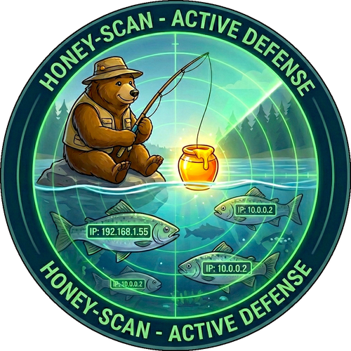

# Honey Cloud Intelligence

<div align="center">
  
  <h1>Honey Cloud Intelligence</h1>
  <p><strong>Schnelle Daten-Brücke für Sicherheit</strong></p>

  [](https://github.com/lemueIO/honey-api/releases/tag/v2.3.0)
  [](https://www.python.org/)
  [](https://www.docker.com/)
  [](https://github.com/lemueIO/honey-api)
  <br>
  [](https://github.com/lemueIO/honey-api)
  [](LICENSE)
  [](https://github.com/lemueIO/honey-api/commits/main)
  [](https://github.com/lemueIO/honey-api/issues)
</div>

<div align="center">
  <h4>
    <a href="README.md">🇬🇧 English</a> | 
    <a href="README_DE.md">🇩🇪 Deutsch</a> | 
    <a href="README_DE2.md">🇩🇪 Einfache Sprache</a>
  </h4>
</div>

---

Honey Cloud Intelligence ist ein Programm für Sicherheit. Es sammelt Daten über Gefahren aus dem Internet. Es holt Daten von eigenen Fallen (Honeypots) und von vielen öffentlichen Listen (über 10 Quellen). Es verhält sich wie die **ThreatBook v3 API**. Das bedeutet, man kann es einfach mit anderen Programmen benutzen. Es ist sehr schnell.

<div align="center">
  <a href="https://api.sec.lemue.org/status">
    
  </a>
  <br>
  <em>Honey Cloud Intelligence Status Dashboard - <a href="https://api.sec.lemue.org/status">Live Ansicht</a></em>
</div>

## [🚀](#was-kann-das-programm) Was kann das Programm?

-   **Daten sammeln**: Es nimmt Daten von innen und außen (Echtzeit + OSINT).
-   **Schnelligkeit**: Es benutzt Redis. Das macht es sehr schnell.
-   **Kompatibilität**: Es spricht die gleiche Sprache wie ThreatBook v3.
-   **Filtern & Aufräumen**:
    -   **Listen**: Man kann erlaubte und verbotene Adressen eintragen (auch ganze Bereiche wie `10.0.0.0/24`).
    -   **Sauberes System**: Das Programm löscht verbotene Adressen automatisch und sehr schnell aus dem Speicher.
-   **Besseres Logbuch (Logging)**:
    -   **Farben & Ordnung**: Das Logbuch ist jetzt farbig und sehr übersichtlich. Man sieht sofort, was das Programm gerade macht.
    -   **Logo**: Ein schönes gelbes Logo erscheint beim Start und alle 12 Stunden.
-   **Überwachung**:
    -   **Konnektivität**: Es prüft automatisch, ob es von außen erreichbar ist (vermeidet Fehler).
    -   **Hilfen**: Es gibt Links und Skripte, um die Verbindung weltweit zu testen.
    -   **Status**: Es gibt einen speziellen `/health` Link für die Überwachung.
-   **Aussehen**: Es gibt eine schöne Übersicht (Dashboard) im Dark Mode.
-   **Status-Seite**: Es gibt eine öffentliche Seite (`/status`), die jeder sehen kann.
-   **Sprachen**: Es gibt das Programm und die Hilfe in Englisch, Deutsch und Ukrainisch.
-   **Einfachheit**: Es läuft in Containern (Docker). Das macht die Installation leicht.

## [🔑](#zugang-und-schlüssel) Zugang und Schlüssel

> [!IMPORTANT]
> **Schlüssel sind geheim.**
> Nicht jeder darf das Programm benutzen. Man braucht einen Schlüssel (API Key). Den bekommt man nur vom Administrator. Bitte fragen Sie nach einem Schlüssel.

## [📦](#installation) Installation

1.  Programm herunterladen:
    ```bash
    git clone https://github.com/lemueIO/honey-api.git
    cd honey-api
    ```

2.  Starten:
    ```bash
    docker compose up -d --build
    ```

3.  Ansehen:
    -   Gehen Sie auf: `http://localhost:8080/login`
    -   Passwort: `admin` (Bitte sofort ändern!)

## [💻](#benutzung) Benutzung

### [🔄](#daten-senden) Daten senden
Andere Programme (HFish) können Daten hierhin schicken. Die Adresse ist:
`http://<deine-server-ip>:8080/api/v1/webhook`

### [🕵️](#nach-gefahren-fragen) Nach Gefahren fragen
Sie können fragen, ob eine IP-Adresse gefährlich ist:
```bash
curl "http://localhost:8080/v3/scene/ip_reputation?apikey=DEIN_SCHLUESSEL&resource=1.2.3.4"
```

## [📖](#api-dokumentation-für-entwickler) API Dokumentation (Für Entwickler)

### 1. [🧠](#1-ip-prüfen-threatbook-v3) IP prüfen (ThreatBook v3)
Hier fragt man ab, ob eine IP böse ist.

- **Adresse**: `/v3/scene/ip_reputation`
- **Art**: `GET`
- **Was man braucht**:
  - `apikey`: Den Schlüssel.
  - `resource`: Die IP-Adresse.
- **Beispiel**:
  ```bash
  curl "http://<server-ip>:8080/v3/scene/ip_reputation?apikey=DEIN_SCHLUESSEL&resource=1.2.3.4"
  ```

### 2. [🎣](#2-daten-empfangen-webhook) Daten empfangen (Webhook)
Hier kommen die Daten von den Fallen an.

- **Adresse**: `/webhook`
- **Art**: `POST`
- **Inhalt**:
  ```json
  {
      "attack_ip": "1.2.3.4"
  }
  ```

### 3. [💓](#3-status-prüfen-health) Status prüfen (Health)
Prüfen, ob das System läuft.

- **Adresse**: `/health`
- **Art**: `GET`
- **Antwort**: `{"status": "ok"}`

## [🛠️](#technik) Technik

-   **Programmierung**: Python 3.9+ (FastAPI)
-   **Speicher**: Redis
-   **Aussehen**: HTML & CSS (Bootstrap 5)
-   **Starten**: Docker & Docker Compose

---

Gemacht von der Honey-Scan Community und [lemueIO](https://github.com/lemueIO) ❤️
