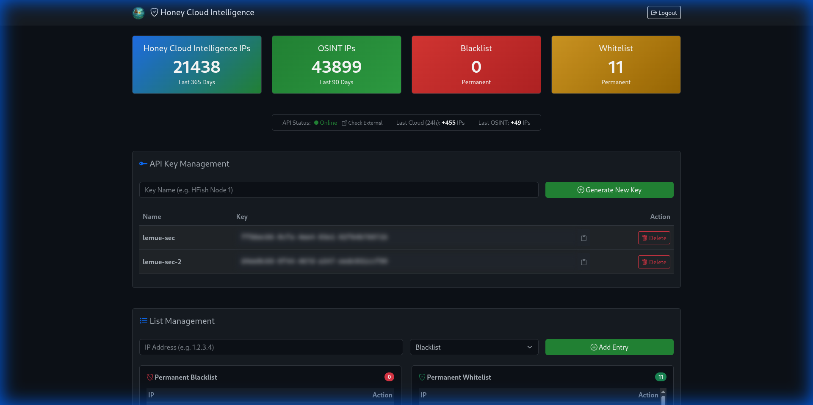

# Honey Cloud Intelligence

<div align="center">
  
  <h1>Honey Cloud Intelligence</h1>
  <p><strong>Високопродуктивний міст та агрегатор розвідки загроз</strong></p>

  [](https://github.com/lemueIO/honey-api/releases/tag/v2.1.0)
  [](LICENSE)
  [](https://www.python.org/)
  [](https://www.docker.com/)
  [](https://github.com/lemueIO/honey-api)
</div>

<div align="center">
  <h4>
    <a href="README.md">🇬🇧 English</a> | 
    <a href="README_DE.md">🇩🇪 Deutsch</a> | 
    <a href="README_DE2.md">🇩🇪 Einfache Sprache</a> |
    <a href="README_UA.md">🇺🇦 Українська</a>
  </h4>
</div>

Honey Cloud Intelligence — це високопродуктивний міст розвідки загроз, розроблений для агрегації, управління та обслуговування даних про загрози з локальних приманок HFish та глобальних джерел OSINT. Він емулює **ThreatBook v3 API**, що дозволяє безшовну інтеграцію з існуючими інструментами безпеки без досягнення зовнішніх лімітів швидкості.

<div align="center">
  
  <br>
  <em>Панель керування Honey Cloud Intelligence з темним режимом та статистикою IP</em>
</div>

## [🚀](#особливості) Особливості

-   **Агрегація загроз**: Поєднує дані в реальному часі з локальних приманок (через HFish) з понад 10 зовнішніми джерелами OSINT.
-   **Висока продуктивність**: Працює на FastAPI та Redis для часу відгуку менше мілісекунди.
-   **Емуляція API**: Повністю сумісний зі стандартом **ThreatBook v3 API**.
-   **Розумна фільтрація**:
    -   **Білий/Чорний список**: Підтримує точні збіги IP та діапазони CIDR (наприклад, `10.0.0.0/24`).
    -   **Пріоритезація**: Власна логіка для визначення пріоритету локальних загроз та ручних списків над даними OSINT.
-   **Надійний моніторинг**:
    -   **Резильєнтна перевірка**: Вбудована перевірка доступності на рівні сокетів (порти 443, 8080), що запобігає HTTP-дедлокам.
    -   **Зовнішня верифікація**: Прямі посилання на Check-Host.net та портативний скрипт для глобальних тестів підключення.
    -   **Ендпоінт здоров'я**: Виділений маршрут `/health` для моніторингу працездатності.
-   **Сучасний інтерфейс**: Елегантна панель керування в темному режимі з живою статистикою, управлінням API ключами та контрольними списками.
-   **Сторінка статусу**: Спрощена, публічна панель статусу (`/status`), доступна без входу.
-   **Багатомовна підтримка**: Повна документація доступна англійською, німецькою (стандартною та спрощеною) та українською мовами.
-   **Контейнеризація**: Створено з Docker та Docker Compose для легкого розгортання.

## [🔑](#доступ-та-ключі-api) Доступ та ключі API

> [!IMPORTANT]
> **Ключі API не є публічними.**
> Доступ до Honey Cloud Intelligence API суворо контролюється. Ключі API видаються тільки через прямий контакт з адміністратором. Будь ласка, зв'яжіться з супроводжувачем проекту, щоб отримати ключ API.

## [📦](#встановлення) Встановлення

1.  Клонуйте репозиторій:
    ```bash
    git clone https://github.com/lemueIO/honey-api.git
    cd honey-api
    ```

2.  Запустіть сервіси за допомогою Docker Compose:
    ```bash
    docker compose up -d --build
    ```

3.  Відкрийте панель керування:
    -   URL: `http://localhost:8080/login`
    -   Пароль адміністратора за замовчуванням: `admin` (Негайно змініть його в `docker-compose.yml`!)

## [💻](#використання) Використання

### [🔄](#синхронізація-даних) Синхронізація даних
Міст приймає дані від вузлів HFish через веб-хук. Переконайтеся, що ваші вузли HFish налаштовані на надсилання даних на:
`http://<ip-вашого-сервера>:8080/api/v1/webhook`

### [🕵️](#запит-репутації) Запит репутації
Зробіть запит до API, емулюючи формат ThreatBook:
```bash
curl "http://localhost:8080/v3/scene/ip_reputation?apikey=ВАШ_API_КЛЮЧ&resource=1.2.3.4"
```

## [📖](#документація-api) Документація API

### 1. [🧠](#1-перевірка-репутації-сумісно-з-threatbook-v3) Перевірка репутації (Сумісно з ThreatBook v3)
Запит даних про репутацію IP.

- **Ендпоінт**: `/v3/scene/ip_reputation`
- **Метод**: `GET`
- **Параметри**:
  - `apikey`: Ваш персональний ключ API.
  - `resource`: IP-адреса для перевірки.
- **Приклад**:
  ```bash
  curl "http://<server-ip>:8080/v3/scene/ip_reputation?apikey=ВАШ_КЛЮЧ&resource=1.2.3.4"
  ```
- **Відповідь**:
  ```json
  {
      "code": 0,
      "data": {
          "1.2.3.4": {
              "severity": "high",
              "judgments": ["permanent blacklist"],
              "update_time": "2024-01-01 12:00:00"
          }
      },
      "message": "success"
  }
  ```

### 2. [🎣](#2-вебхук-сумісно-з-hfish) Вебхук (Сумісно з HFish)
Отримання журналів атак від вузлів HFish.

- **Ендпоінт**: `/webhook`
- **Метод**: `POST`
- **Content-Type**: `application/json`
- **Тіло запиту**:
  ```json
  {
      "attack_ip": "1.2.3.4"
  }
  ```

### 3. [💓](#3-перевірка-здоровя) Перевірка здоров'я
Моніторинг стану системи.

- **Ендпоінт**: `/health`
- **Метод**: `GET`
- **Відповідь**: `{"status": "ok"}`

## [🛠️](#технологічний-стек) Технологічний стек

-   **Бекенд**: FastAPI (Python 3.9+)
-   **База даних**: Redis (Ключ-значення)
-   **Фронтенд**: Шаблони Jinja2, Bootstrap 5 (Кастомна темна тема)
-   **Розгортання**: Docker-контейнери та Docker Compose

---

Підтримується спільнотою Honey-Scan та [lemueIO](https://github.com/lemueIO) ❤️
